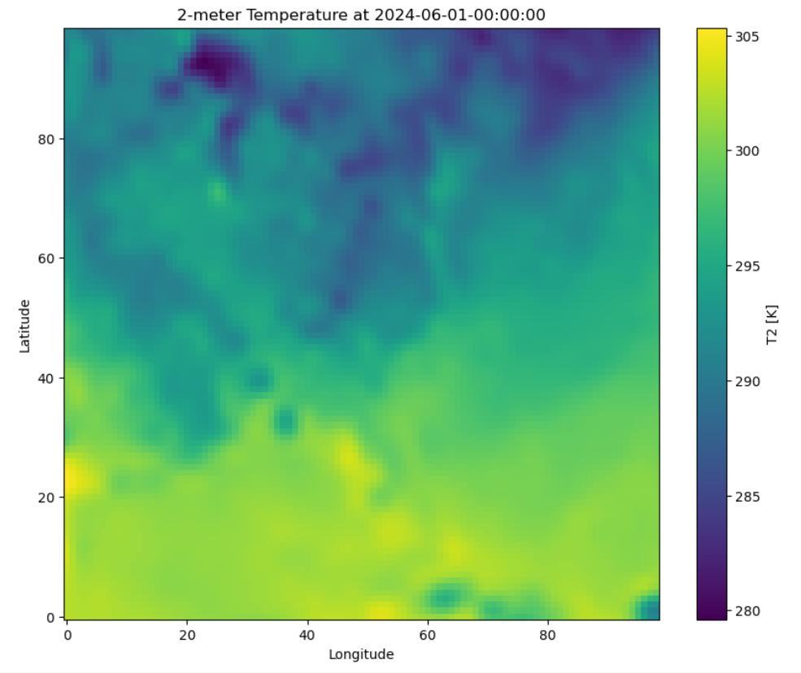
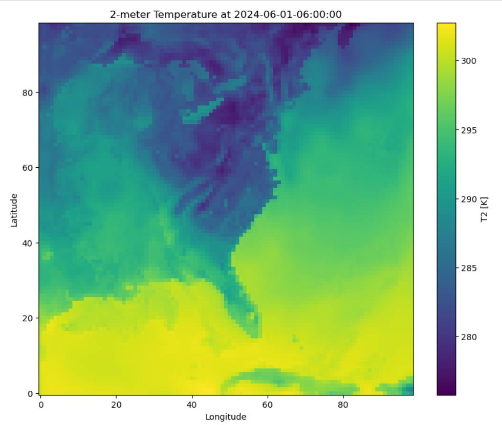
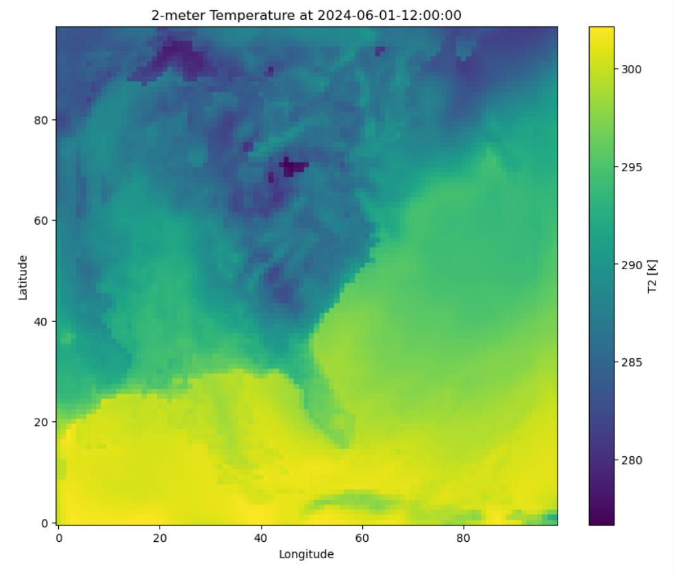
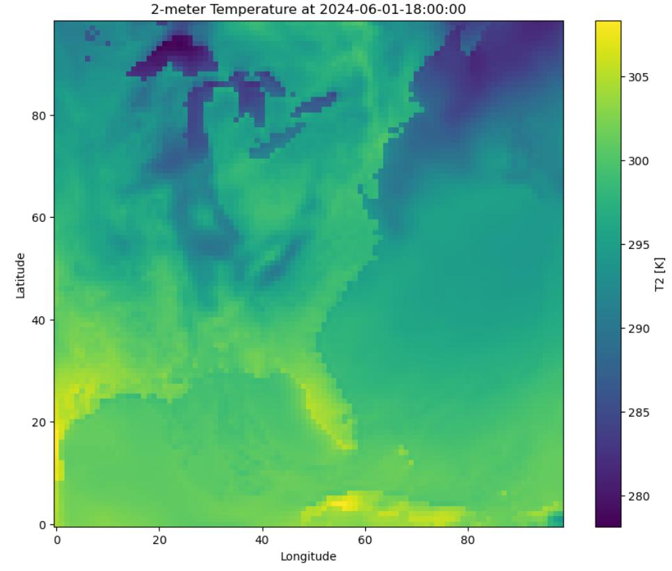
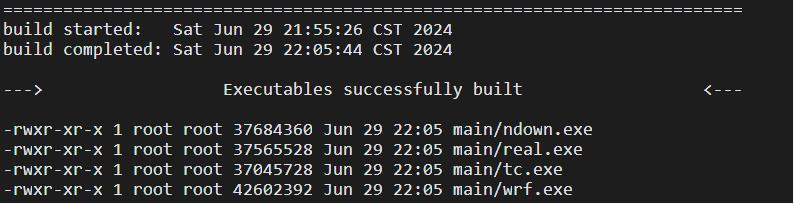
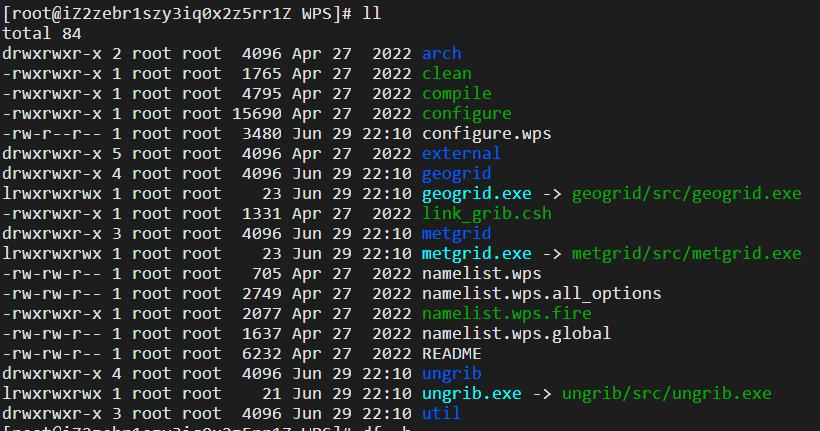

# 2024/6/28 WRF学习成果 #

1. Deploy WRF 4.2.2 model in Centos7.9 system. (Ali icloud service)

2. Run test from "2024-06-01 00:00:00" to "2024-06-01 18:00:00" and get results. Here is Temp-2m heatmap in southern America.
            
            
            
            

# 2024/6/29 WRF-AH from DanLi #

1. Reference website
1) https://blog.csdn.net/baidu_35848778/article/details/139138530
2) https://huaweicloud.csdn.net/63564186d3efff3090b5c69c.html?spm=1001.2101.3001.6650.2&utm_medium=distribute.pc_relevant.none-task-blog-2%7Edefault%7Ebaidujs_baidulandingword%7Eactivity-2-121870313-blog-121849142.235%5Ev43%5Epc_blog_bottom_relevance_base9&depth_1-utm_source=distribute.pc_relevant.none-task-blog-2%7Edefault%7Ebaidujs_baidulandingword%7Eactivity-2-121870313-blog-121849142.235%5Ev43%5Epc_blog_bottom_relevance_base9&utm_relevant_index=3

2. Note: configure select [32]

3. git commond:

mkdir -p /public/software/wrf/WRF

git clone https://github.com/DanLi-BU/WRF.git /public/software/wrf/WRF

cd /public/software/wrf/WRF

git checkout AH_CHS_outputs
	
	

# namelist.wps set_up: #
&share
 wrf_core = 'ARW',
 max_dom = 2,
 start_date = '2016-08-01_00:00:00', '2016-08-01_00:00:00',
 end_date   = '2016-08-02_00:00:00', '2016-08-02_00:00:00',
 interval_seconds = 21600,
 io_form_geogrid = 2,
/

&geogrid
 parent_id         = 1, 1,
 parent_grid_ratio = 1, 3,
 i_parent_start    = 1, 31,
 j_parent_start    = 1, 17,
 e_we              = 74, 112,
 e_sn              = 61, 97,
 geog_data_res     = '30s', '30s',
 dx = 20000,
 dy = 20000,
 map_proj = 'lambert',
 ref_lat   = 34.02603879478449,
 ref_lon   = -118.28803401203643,
 truelat1  = 30.0,
 truelat2  = 60.0,
 stand_lon = -118.28803401203643,
 geog_data_path = '/public/software/wrf/WPS_GEOG',
/

&ungrib
 out_format = 'WPS',
 prefix = 'FILE',
/

&metgrid
 fg_name = 'FILE',
 io_form_metgrid = 2,
/
